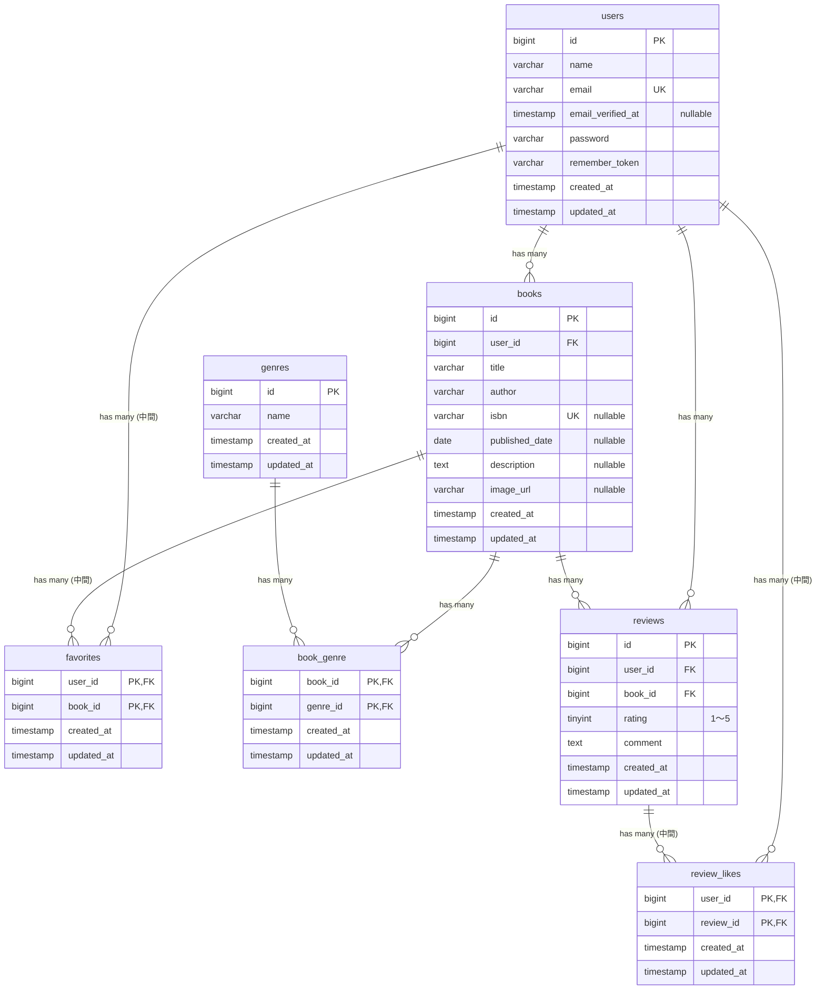

# BookShelf 書籍レビューアプリ

## 概要
Bookshelfは書籍のレビューと管理ができるWebアプリケーションです。  

ユーザーは書籍を登録し、レビューや評価を投稿できます。  
また、気に入った書籍をお気に入りに登録したり、他のユーザーのレビューにいいねをすることができます。  
その他にも、ランキングや、マイ読書レポートなどの機能を提供します。

## 🪄使用技術一覧
### バックエンド


### フロントエンド


### 開発ツール


### データベース


### インフラ・開発環境


## 🔍目次
1. [主な機能](#主な機能)
2. [ER図](#er図)
3. [環境構築手順](#️環境構築手順)
4. [APIエンドポイント一覧](#apiエンドポイント一覧)
5. [開発環境URL](#開発環境url)
6. [ログイン情報](#ログイン情報)
7. [テストの実行方法](#テストの実行方法)
8. [作成者](#作成者)

## 📌主な機能
- 書籍の登録・編集・削除
- レビューの投稿・編集・削除
- 書籍お気に入り機能
- いいね機能
- ジャンル管理
- 書籍ランキング表示
- マイ読書レポート
- 書籍検索・フィルタ・ソート
- ISBN検索（Google Books API連携）
- 公開API

## 🧩ER図


## ⛏️環境構築手順

1. リポジトリのクローン
以下のコマンドを実行してリポジトリをクローンし、プロジェクトのディレクトリに移動します。  
```
git clone https://github.com/Sumire1256/bookshelf-app.git
cd bookshelf-app
```
2. `.env.example` から `.env` を作成
```
cp .env.example .env
```
3. composerでパッケージをインストール
```
docker run --rm \
    -u "$(id -u):$(id -g)" \
    -v "$(pwd):/var/www/html" \
    -w /var/www/html \
    -e COMPOSER_CACHE_DIR=/tmp/composer_cache \
    laravelsail/php82-composer:latest \
    composer install
```
4. Sailを起動
```
sail up -d
```

### Laravel環境構築
1. アプリケーションキーを生成
```
sail artisan key:generate
```
2. データベースのマイグレーションと初期データ投入
```
sail artisan migrate:fresh --seed
```
3. フロントエンドのパッケージをインストール・ビルド
```
sail npm install

# 開発時
sail npm run dev

# 本番・デモ確認時
sail npm run build
```

## 📱APIエンドポイント一覧
### 認証
| メソッド | URI | 説明 | 認証 |
|---------|-----|------|------|
 | /api/v1/login | ログインしてトークンを取得する | 不要
 | /api/v1/logout | ログアウトしてトークンを削除する | Sanctum

### 書籍
HTTPメソッド | URI | 説明 | 認証
--- | --- | ---| ---
 | /api/v1/books | 書籍一覧を取得する（検索・ページネーション付き） | 不要
 | /api/v1/books/{book} | 書籍詳細を取得する（ジャンル情報・レビュー含む） | 不要
 | /api/v1/books | 書籍を新規登録する | Sanctum
 | /api/v1/books/{book} | 書籍を更新する | Sanctum + BookPolicy(所有者のみ)
 | /api/v1/books/{book}| 書籍を削除する | Sanctum + BookPolicy(所有者のみ)

## 🌐開発環境URL
- アプリ: http://localhost
- phpMyAdmin: http://localhost:8080

## 🔓ログイン情報
| 名前 | メールアドレス | パスワード |
|------|-------------|-----------|
| 山田太郎 | yamada@example.com | password |
| 鈴木花子 | suzuki@example.com | password |
| 田中一郎 | tanaka@example.com | password |
| 佐藤美咲 | sato@example.com | password |
| 高橋健太 | takahashi@example.com | password |

## 💯テストの実行方法
- 全テスト実行
```
sail artisan test
```

- カバレッジ確認
```
sail artisan test --coverage
```

- コードフォーマット確認
```
sail bin pint --test
```

## 作成者
👩🏻‍💻 https://github.com/Sumire1256
